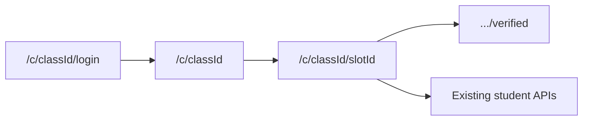

# Student-facing UI redesign

## Current state

Student pages are single-file client components using custom CSS utilities in [`src/app/globals.css`](src/app/globals.css) (`.card`, `.btn-primary`). There is **no `components/ui` folder, no `components.json`, and no shadcn/Radix/sonner/lucide deps** — despite the request. Professor pages use the same utilities, so shadcn init must **keep those classes working**.

Gaps vs the desired UX:

- Login does not fetch class name/term. [`GET /api/classes/[classId]`](src/app/api/classes/[classId]/route.ts) is **prof-auth only**.
- Slot page never loads slot/class metadata (label, deadline, `titlesRequiredMin`, required fields). [`GET /api/student/slots`](src/app/api/student/slots/route.ts) already returns full slot rows — usable after login.
- No leave-group route. Invite/create/respond exist.
- Title PATCH exists ([`src/app/api/student/titles/[titleId]/route.ts`](src/app/api/student/titles/[titleId]/route.ts)); UI never calls it.
- Schema has **no rejection reason**. Prof verify only sets `status`.
- Title POST checks membership but **not** `group.status === 'locked'`, and does not enforce `titlesAllowedMax`.



## 1. Foundation: shadcn + student shell

- Run `npx shadcn@latest init` (neutral, CSS variables) and add: `card`, `button`, `badge`, `input`, `textarea`, `dialog`, `tabs`, `alert`, `separator`, `avatar`, `progress`, `skeleton`, `label`, `sonner`.
- Map `--primary` to the existing accent (`#3b5bfd`). Keep `.btn-primary` / `.card` aliases in [`globals.css`](src/app/globals.css) so dashboard pages do not break.
- Add `Toaster` in [`src/app/layout.tsx`](src/app/layout.tsx).
- Shared student components under `src/components/student/`:
  - `status-badge.tsx` — forming (blue), locked (green), pending (amber), verified (green), rejected (red)
  - `group-members.tsx` — Avatar initials + names + `n/maxSize`
  - `title-card.tsx` — status, description, tech badges, rejection reason, edit, repo field
  - `empty-state.tsx` — lucide icon + heading + CTA
  - `student-header.tsx` — class/slot title, logout, back links

## 2. Small API/schema additions (only what the UI needs)

Keep existing student routes; add/extend these:

| Need | Approach |
|---|---|
| Login class name + term | New public `GET /api/student/class-info?classId=` returning `{ name, term }` only |
| Slot header + title rules | Client already can use `GET /api/student/slots` and pick by `slotId` — no new route |
| Leave group | New `POST /api/student/groups/[groupId]/leave` — only if `status === 'forming'`; remove membership; delete group if empty |
| Rejection reason | Add nullable `rejection_reason` on `titles`; accept optional `comment` on existing prof verify PATCH; show it on student title cards. Prof reject UI gets a small optional comment so the field can actually be filled |
| Submit titles only when locked | In existing titles POST, require group `locked` (or solo). Also block when `titles.length >= titlesAllowedMax` |

No other schema changes. Duplicate check stays on [`GET /api/student/titles/check`](src/app/api/student/titles/check/route.ts).

## 3. Login — [`src/app/c/[classId]/login/page.tsx`](src/app/c/[classId]/login/page.tsx)

Server page fetches class info; client form:

- Centered `Card`, heading **Student Login**, class name + term
- shadcn `Input` / `Label` / `Alert` for errors, submit `Button` with loading
- Link back to `/`
- Same `POST /api/student/login` → redirect `/c/[classId]`

## 4. Main slot page (priority) — [`src/app/c/[classId]/[slotId]/page.tsx`](src/app/c/[classId]/[slotId]/page.tsx)

Split into a thin server page (auth redirect already in middleware) and a client dashboard that loads in parallel:

- `GET /api/student/slots` + `GET /api/student/groups?slotId=`
- `GET /api/student/invites`, `without-group`, `titles`, `titles/verified` (preview)

**Header card**

- Class name + slot label (from slots + class-info)
- Group status badge
- Deadline: formatted date + simple countdown if in the future; `Alert` if past due
- `Progress`: `min(titles.length, titlesRequiredMin) / titlesRequiredMin` with copy `Titles: n / m required`

**Pending invites** sit above tabs (accept/decline with toasts).

**Tabs**

1. **My Group**
   - No group: empty state CTAs Create Group / wait for invite; list ungrouped students
   - Forming: members, remaining slots, Invite `Dialog` (searchable list + confirm), Leave `Dialog` (destructive)
   - Locked / solo: members + `Alert` “Group is locked. You can now submit titles.”
2. **Submit Titles** — disabled (tabs `disabled` + explanation) until group is locked. Form: title, description, tech-stack chips (enter/comma), target users (respect `requireTechStack` / `requireTargetUsers`). Live duplicate `Alert` (amber). Hide submit if at max. List group titles via `TitleCard`; edit pending (and rejected) via dialog → existing PATCH; repo/deployment on verified titles via existing repo PATCH.
3. **Verified** — 3–6 card preview + link to full page. Empty state if none.

Skeletons while loading. Toasts on invite/create/submit/leave/errors.

Also lightly restyle [`src/app/c/[classId]/page.tsx`](src/app/c/[classId]/page.tsx) (slot picker after login) with the same cards/header so the flow is not visually broken.

## 5. Verified page — [`src/app/c/[classId]/[slotId]/verified/page.tsx`](src/app/c/[classId]/[slotId]/verified/page.tsx)

Keep `GET /api/student/titles/verified?slotId&q=`.

- Search input (existing `q`)
- Client-side filter chips from loaded titles’ tech stack / target users (no API change)
- Responsive card grid: title, description, tech badges, target users, members, repo/deployment links if present
- Skeleton + empty state

## File layout (new)

```
src/components/ui/*                 # shadcn
src/components/student/status-badge.tsx
src/components/student/group-members.tsx
src/components/student/title-card.tsx
src/components/student/empty-state.tsx
src/components/student/student-header.tsx
src/app/c/[classId]/login/login-form.tsx
src/app/c/[classId]/[slotId]/slot-dashboard.tsx
src/app/api/student/class-info/route.ts
src/app/api/student/groups/[groupId]/leave/route.ts
```

Existing student mutation routes stay; pages become structured client islands, not one 340-line file.

## Verification

No browser MCP assumed to have a live logged-in student. After implementation: run the app, walk login → class home → slot tabs (empty group, forming, locked), title submit/edit, verified search/filter, and confirm prof dashboard still renders with leftover `.card` / `.btn-*` classes.
